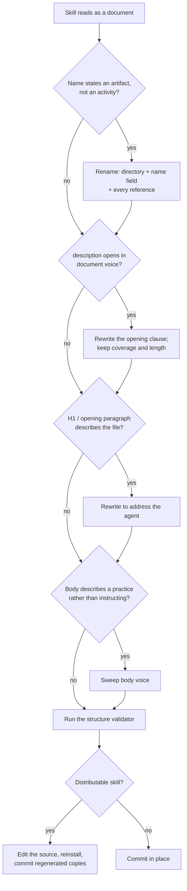

# Capability Framing

Apply this reference when naming a new skill, writing its discovery metadata and opening, or recasting an existing skill that reads as a document rather than as something the agent can do.

## Capability, Not Document

A skill is loaded into an agent to extend what that agent can do. It should therefore present itself as a **capability** — an ability the agent gains — rather than as a document it has been handed. The test is one sentence: reading only the name and the first line, could the agent say _"I can do this"_? A skill that instead reads as "here is a file about X" makes the agent a reader of rules rather than a practitioner of them.

This governs **presentation**, not content. Normative RFC-2119 guideline bullets remain the way rules are expressed here, and a skill whose entire body is guidelines is perfectly well-formed — as long as the skill presents as the capability those guidelines constitute.

**Good Examples:**

> `code-review` — an H1 and opening paragraph reading "The ability to review a code change and report findings that hold up." (This models the `name` and body surfaces. `description` takes the trigger first instead — see [Frontmatter Voice](#frontmatter-voice).)

> `software-instrumentation` — "Use this capability whenever you instrument software to make its behavior observable."

**Bad Examples:**

> `code-review-guidelines` — "This skill documents our code review guidelines."

> `logging-best-practices` — "A collection of best practices for logging."

**Guidelines:**

- SHOULD frame every skill as a capability the agent gains, across all four surfaces below: name, `description`, H1 and opening paragraph, and body voice.
- MUST NOT read the capability rule as discouraging guideline content; rules stay in `**Guidelines:**` blocks and lose nothing by being framed as a capability.
- SHOULD apply the one-sentence test — could the agent say "I can do this" from the name and first line alone? — before considering framing settled.
- SHOULD treat a skill that fails the test as a recast candidate rather than a defect, and follow [Recasting an Existing Skill](#recasting-an-existing-skill).

## Naming as a Capability

The name is the first and most-read surface, and it survives every later rewrite. Name the activity the skill enables, not the artifact that documents it. This section is the single owner of the naming preference; [frontmatter-and-naming.md](./frontmatter-and-naming.md) owns the mechanical rules (kebab-case, length, directory match) and [scoping-and-mece.md](./scoping-and-mece.md) owns boundary and scope alignment.

| Prefer                  | Over                                |
| ----------------------- | ----------------------------------- |
| `code-review`           | `code-review-guidelines`            |
| `application-security`  | `application-security-requirements` |
| `code-maintainability`  | `maintainable-code-guidelines`      |
| `end-to-end-testing`    | `e2e-testing-best-practices`        |
| `agent-skill-authoring` | `skill-authoring-rules`             |

**Guidelines:**

- SHOULD name a skill for the activity it enables — an activity noun (`code-review`), an `-ing` gerund (`agent-skill-authoring`), or a quality-of-work domain (`code-maintainability`).
- SHOULD NOT use a `-guidelines`, `-best-practices`, `-principles`, `-conventions`, `-rules`, or `-requirements` suffix; the suffix names the document, and the activity beneath it is almost always the better name.
- SHOULD use a plain verb name (`address`, `handoff`) for a workflow entry-point skill whose `/<name>` invocation reads as a command.
- MUST rename a skill when a scope change leaves its name pointing at the wrong capability, updating the frontmatter `name`, the directory, and every reference in the same change.
- SHOULD weigh a rename against its churn on an established skill: framing is a SHOULD, and a stable name that already reads as an activity does not need renaming to match a preferred pattern exactly.

## Frontmatter Voice

`description` is the only text the runtime sees before loading the body — so the capability has to be legible there, but it does not get the opening. A host truncates the listing to a budget, and the opening bytes are the ones a router actually reads, so they belong to the trigger. The capability shows in the clause that follows it. Ordering, trigger keywords, and the length target belong to [description-writing.md](./description-writing.md) — this section adds only the voice.

**Example:**

```yaml
description: Instrumenting software so its behavior is observable in production — writing or reviewing code that logs, throws, catches, reports an error, or configures a logger. The three telemetry signals plus the error handling that makes them actionable. Covers structured logging, ...
```

**Guidelines:**

- MUST NOT open `description` with a framing formula such as "The ability to …". It reads as capability voice while spending the field's scarcest bytes on words that carry no routing decision.
- SHOULD name the capability in `description` in the clause after the trigger, as an activity noun phrase ("the design vocabulary and rules for …", "a complete methodology for reviewing …") rather than a sentence about the skill.
- MUST NOT open with document voice — "This skill …", "This document …", "These guidelines …", "A collection of …", "Guidelines for …", "Instructions for …" — which `description-writing.md` also forbids as third-person passive prose.
- MUST keep the explicit capability framing in the `name`, the H1, and the opening paragraph, where nothing is truncated and the reader is deciding what kind of thing they loaded.

## Body Voice — H1 and Opening Paragraph

The opening paragraph is where a reader decides what kind of thing they have loaded. Address the agent directly and say what the skill lets it do and when to reach for it, rather than describing the file. The body that follows keeps the same posture: rules read as things the agent does.

**Example:**

```markdown
# Application Security

Use this capability whenever you write or review code that handles untrusted
input, secrets, outbound requests, rendered content, or third-party
dependencies. It runs in two modes over the same set of rules:
```

**Conforming opening formulas:**

> `Use this capability whenever you …`

> `This skill equips you to …` — names the capability and addresses the agent

> `You are the <name> …` — for a workflow entry-point skill that drives a run

**Guidelines:**

- MUST title the skill with an H1 matching its `name` in title case, and nothing else.
- SHOULD open the body by addressing the agent in the second person and stating both what the capability is and when to reach for it.
- SHOULD NOT open with document voice ("This document collects …", "These are the rules for …") or with a bare noun-phrase definition that never says who acts.
- SHOULD keep the body in the same voice — an instruction the agent carries out, not a description of a practice that exists somewhere.
- MAY state a skill's self-containment, host-deference, or precedence notes in the opening paragraph after the capability sentence, as a distributable skill usually must.

## Recasting an Existing Skill

Recasting is a mechanical pass in a fixed order — outermost surface first, because each step constrains the next. A recast changes how the skill presents itself and MUST NOT quietly change what it requires; a rule that needs to change is a separate concern from the recast.



**Guidelines:**

- MUST preserve every existing requirement through a recast; changing what a guideline demands is a separate change from changing how the skill presents itself.
- MUST keep `description` within its byte cap after rewriting an opening clause, trimming duplicated synonyms rather than trigger text.
- MUST update every reference to a renamed skill — cross-references, the host project's skill index if it keeps one, and any workflow that invokes it — in the same change.
- MUST edit a distributable skill at its source and reinstall rather than hand-editing the installed copy, per your project's skill-management conventions.
- SHOULD run the bundled `scripts/check-skill-frontmatter.mjs` after a recast; it reports document-voice names and descriptions as advisory warnings (see [audit-checklist.md](./audit-checklist.md)).
- SHOULD recast a skill when work already touches it, rather than opening a sweep across every skill at once.
