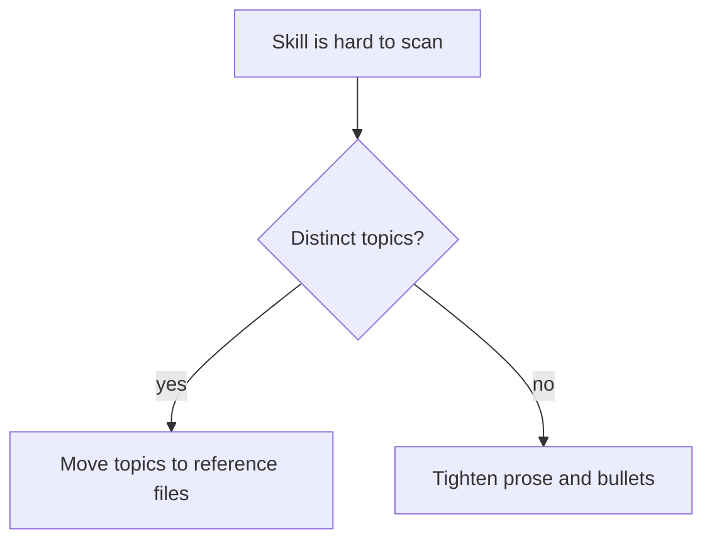

# Scoping and MECE

Apply this reference when deciding what a skill covers, where its boundary sits against neighbors, and whether new guidance needs its own skill.

## Coherent Unit

A skill should describe one unit of work that is loaded, applied, and revised together. If two responsibilities would usually be needed by different prompts, they usually belong in different skills.

**Good Examples:**

> code-review-guidelines owns review reporting and severity.

> quality-assurance owns verification evidence.

**Bad Example:**

> review-and-test-and-security-guidelines owns three separate decision contexts.

**Guidelines:**

- MUST encapsulate a single coherent unit of work in each skill.
- SHOULD scope a skill so the directory name signals its responsibility.
- SHOULD split responsibilities that belong to different decision contexts.
- MUST NOT make two skills responsible for the same rule.

## Mutual Exclusivity

Mutual exclusivity prevents drift. When two skills need the same guidance, choose one source of truth and make the other skill link to it under a clear trigger condition.

**Guidelines:**

- MUST verify that a new or revised skill does not duplicate responsibility already owned by a sibling skill.
- MUST choose one home when a rule appears to fit two skills.
- SHOULD sharpen neighboring skill boundaries when readers are likely to pick the wrong skill.
- MUST NOT duplicate rule wording across skills for convenience.

## Portable Source Exception

A self-contained skill authored for installation into other projects (a `skills/`-sourced skill) is a sanctioned exception to strict mutual exclusivity: it MAY restate a rule another skill owns, because it must stand alone where that owner is absent. The exception is bounded — the restating skill still defers to the owner when one is present, and it is not a license to duplicate freely.

The exception covers two shapes. The familiar one is a portable skill restating a rule a **repo-native** skill owns. The second is one portable skill restating a rule **another portable skill** owns, which applies when the restating skill advertises self-containment and would otherwise ship a hole where the owner is not installed: a change-loop skill's condensed plan-document structure restates what a product-requirement skill owns in full, and defers to it by topic when that skill is present. What stays forbidden is duplication that buys nothing — the same rule in two skills where neither needs to stand alone.

**Guidelines:**

- MAY let a self-contained, installable source skill restate a rule owned by another skill — repo-native or portable — when portability requires the restating skill to stand alone.
- MUST have the restating skill defer to the owning skill by topic when that owner is present, rather than competing with it.
- MUST NOT invoke this exception where neither skill needs to stand alone — between two repo-native skills, or between two portable sources whose scopes do not require independent installation.
- MUST keep the restated copy visibly a deferring summary — shorter than the owner's treatment, and naming the owner's topic — rather than a divergent second source of truth.
- SHOULD verify, when adding a restatement, that the restating skill is still executable with the owner absent; a restatement that leaves a term undefined has not bought the portability it claims.

## Mechanism Beneath a Tool-Agnostic Owner

A vendor- or runner-specific skill added beneath a tool-agnostic one inherits a boundary that is easy to state and easy to breach: the specific skill owns **mechanism** — the package, the option, the call signature, the command — while the tool-agnostic skill keeps **judgment**, meaning what is worth doing, when, and why. The breach is rarely deliberate. Explaining why a rule matters reads as helpful in any one section, and a skill that does it in nine becomes a second source of truth for rules it does not own, free to drift from the first.

Noticing the duplication while writing does not work, because each instance looks reasonable on its own. Enumerate instead:

1. List every section the new skill will carry.
2. Classify each as **mechanism** — true only of this vendor or runner — or **judgment** — true of any tool in the category.
3. For each judgment section, name the tool-agnostic owner and cut the section down to a deferral pointing at it.
4. For each mechanism section, swap the vendor out in your head; a rule that still holds is judgment wearing a vendor's name.

**Example:**

> "Mock only what is slow or non-deterministic" survives swapping the runner, so it is judgment and a unit-testing skill owns it. "`vi.mock` is hoisted above the imports, so its factory cannot close over a `const` declared later" does not survive the swap, so it is mechanism.

**Guidelines:**

- MUST enumerate and classify every section as mechanism or judgment when adding a vendor- or runner-specific skill beneath a tool-agnostic one, rather than relying on spotting duplication while writing.
- MUST name the tool-agnostic owner in each judgment section and reduce that section to a deferral, per the cross-reference rule in [body-content-style.md](./body-content-style.md).
- MUST hold a judgment section retained under the [Portable Source Exception](#portable-source-exception) to that exception's bounds — shorter than the owner's treatment and naming the owner's topic — rather than treating portability as a licence to restate the rationale.
- MUST NOT let a citation of the owner sit beside a full restatement of the owner's rule; the deferral replaces the rule, it does not annotate it.
- SHOULD record the classification in the change's plan or pull request when the skill is large enough that a reviewer cannot cheaply redo it.

## Collective Exhaustiveness

Within its declared scope, a skill should cover the practical cases an agent will encounter. Gaps are acceptable only when the skill narrows its scope or points to a different owner.

**Guidelines:**

- SHOULD address every reasonable responsibility inside the skill's declared scope.
- MUST either fill an in-scope gap or narrow the stated scope so the gap is no longer promised.
- MAY list out-of-scope concerns when the boundary is easy to misunderstand.
- SHOULD cross-reference the source skill when an adjacent topic is intentionally out of scope.

## When to Split

Splitting is a remedy for bloat or mixed topics, not a formatting preference. A split should make the skill easier to load selectively.

**Example:**

**Guidelines:**

- SHOULD split a skill when `SKILL.md` crosses the size thresholds in [progressive-disclosure.md](./progressive-disclosure.md).
- SHOULD split when one section exceeds the section-length ceiling (below).
- SHOULD split when one `description` cannot carry both the trigger and the coverage within the discovery length target (see [description-writing.md](./description-writing.md)).
- SHOULD NOT split a small, cohesive skill only to match neighboring file layouts.

## When to Consolidate

Consolidation removes dead-weight routing. Two skills that trigger on the same prompts and repeat the same content usually need one owner, not two entry points.

**Guidelines:**

- SHOULD consolidate skills whose descriptions trigger on the same prompts and whose bodies substantially overlap.
- SHOULD consolidate a forwarding-only skill into the skill it forwards to.
- MUST pick and document the source-of-truth skill during consolidation.
- MUST update cross-references and index links in the same change.

## Section-Length Ceiling

Section length is a readability signal. When a section needs too many bullets, the topic is probably hiding subtopics.

**Guidelines:**

- SHOULD keep each substantive section near seven guideline bullets.
- MUST NOT exceed ten guideline bullets without stating why the exception is necessary.
- SHOULD split an overgrown section into clearer subsections or move detail into a reference file.
- MAY use H3, H4, or deeper headings when they clarify hierarchy without hiding the source-of-truth rule.
- MUST apply the ceiling independently to `SKILL.md`, nested subsections, and each reference file.

## Naming Aligned with Scope

The skill name is the first boundary cue a future agent sees. A capability name such as `code-review` is clearer than an actor or file-type name such as `reviewer-skill`; [capability-framing.md](./capability-framing.md) owns how to phrase that capability, while this section covers only its alignment with the skill's scope.

**Guidelines:**

- MUST choose a directory name that signals the skill's responsibility.
- SHOULD name the responsibility, not the actor or storage format.
- SHOULD rename a skill when refactoring changes its scope.
- MUST resolve conceptual overlap before choosing between similar names.
