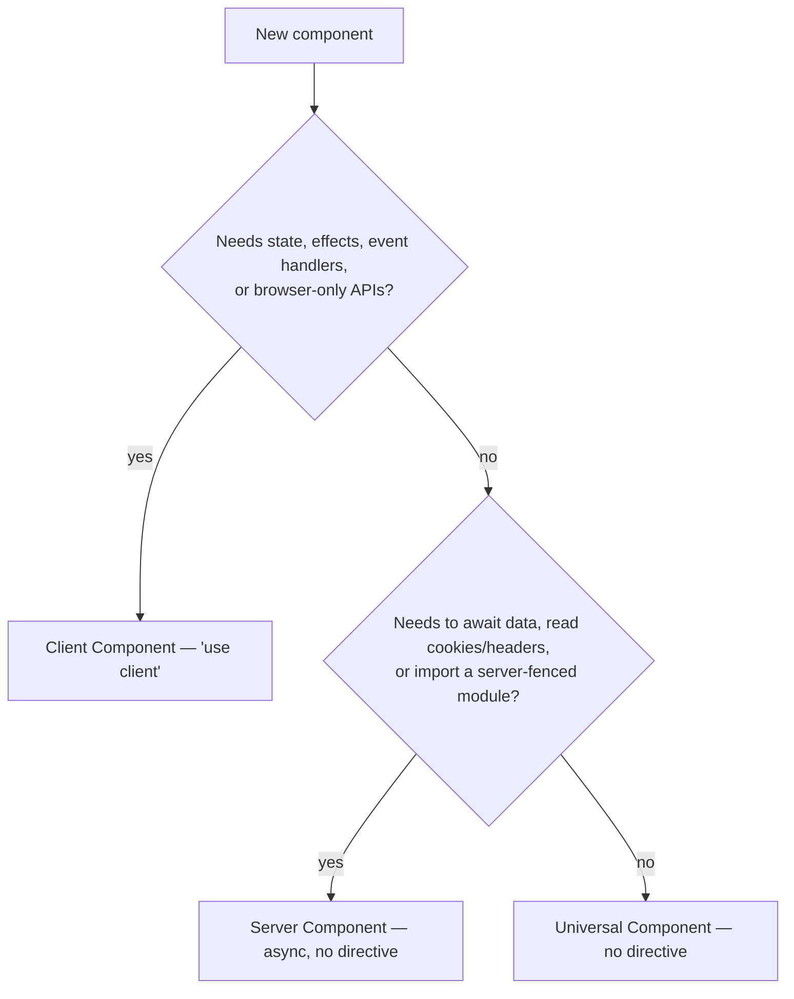

# Component Boundaries

Apply this reference when deciding where a component runs, adding or moving a `"use client"` directive, passing props across the boundary, or reviewing a change that touches either side of it.

## Three Categories, Not Two

The framing "server component or client component" hides the largest category. Most components are neither: they take props and return JSX, use no hooks, read no request data, and import nothing server-fenced. Those are **universal components**, and they run wherever their caller runs.



A universal component is defined by four constraints, all of which must hold:

1. No `"use client"` or `"use server"` directive.
2. No React hooks, no event handler props wired to browser events.
3. No import of a `server-only` module, and no request-time API.
4. No `async` body awaiting data.

**Guidelines:**

- MUST default a new presentational component to universal — no directive — and add one only when a constraint above is actually violated.
- MUST NOT add `"use client"` to a component merely because a Client Component imports it; a universal component works from both sides, and marking it forces it into the client bundle for every caller.
- SHOULD keep universal components free of framework imports entirely, so they stay testable as plain functions.

## What Belongs on the Server

The server side is not just "everything that is not interactive". It is a positive catalogue of work that is cheaper, safer, or only possible there:

- **Data access** — querying a database, calling an internal service, reading the filesystem.
- **Secret handling** — anything touching an API key, a signing key, or a session secret. A secret used in a Client Component is a published secret.
- **Encryption and hashing** — work that must not be reproducible by the caller.
- **Heavy transforms** — rendering Markdown, parsing large documents, generating images. The output ships; the library does not.
- **Authorization decisions** — see the authentication reference.

**Guidelines:**

- MUST perform data access, secret handling, and authorization on the server, never in a component that ships to the browser.
- SHOULD move an expensive pure transform to the server when its input is server-known, so the library cost stays out of the client bundle.
- MUST NOT pass a secret across the boundary as a prop in order to do server work on the client; move the work instead.

## Placing the Client Boundary

`"use client"` is not a per-component annotation — it marks an entry point into the client graph, and **everything that module imports is pulled in with it**. Placing it high in the tree is the most common way a bundle grows without anyone deciding to grow it.

**Guidelines:**

- MUST place `"use client"` at the lowest component that genuinely needs it — the interactive leaf, not the page or the layout that contains it.
- MUST write the directive as the first statement in the file, above every import.
- SHOULD extract the interactive part of a mostly-static component into its own client leaf rather than marking the whole component.
- MUST NOT place `"use client"` in a shared utility module that both sides import; fence or split it instead.

## Crossing the Boundary

Props passed from a Server Component to a Client Component are serialized. The serialization is React's, not `JSON.stringify` — it carries dates, maps, sets, and typed arrays, but not functions, class instances, or symbols.

**Guidelines:**

- MUST pass only serializable values across the boundary: primitives, plain objects, arrays, dates, maps, sets, typed arrays, and React elements.
- MUST NOT pass a class instance, a database model object, a function (other than a server function), or a symbol; the render fails with a serialization error.
- MUST pass a plain transfer object rather than an ORM entity — the entity usually serializes as far as its methods, then fails, and it carries fields the client should not see.
- MAY pass a server function across the boundary; it is serialized as a reference, and calling it becomes a network request.

## Interleaving

A Client Component can render a Server Component, but only as a **passed child**, never as an import. The client module graph cannot contain a server module, so the composition has to be built on the server and handed down.

```tsx
// Works: the server builds the tree, the client component receives it as children.
<ClientShell>
  <ServerContent />
</ClientShell>

// Fails: ClientShell importing ServerContent pulls a server module into the client graph.
```

**Guidelines:**

- MUST compose a Server Component into a Client Component through `children` or another element prop, never through an import inside the client module.
- SHOULD design client wrappers to accept `children` for exactly this reason — a provider, a modal shell, or an animation wrapper that takes children stays composable with server content.

## Async Client Components

Only Server Components may be async. A Client Component that awaits looks reasonable and fails at render, because there is no server pass in which the promise could resolve before hydration.

**Guidelines:**

- MUST NOT declare a Client Component `async`; only Server Components may be async.
- MUST read a promise prop in a Client Component with React's `use()` inside a Suspense boundary, rather than awaiting it.

## Two Composition Patterns

These are the shapes that keep the boundary honest in practice.

**Universal entrypoint over a loaded server component and a loading component.** The entrypoint is universal and owns the Suspense boundary; the loaded component is the server component that awaits data; the loading component is the skeleton. All three are separately testable, and the entrypoint can be rendered from either side.

```tsx
// article-detail.tsx — universal, no directive
export function ArticleDetail({ slug }: { slug: string }) {
  return (
    <Suspense fallback={<ArticleDetailLoading />}>
      <ArticleDetailLoaded slug={slug} />
    </Suspense>
  );
}
```

**Server entrypoint with interactive client leaves.** The server component fetches and renders the static structure; each interactive control is its own client leaf receiving plain data and a server function.

```tsx
export async function ArticleActions({ id }: { id: string }) {
  const article = await getArticle(id); // server-fenced
  return (
    <>
      <ArticleMeta article={toArticleView(article)} /> {/* universal */}
      <BookmarkButton articleId={id} onToggle={toggleBookmark} />{" "}
      {/* client leaf */}
    </>
  );
}
```

**Guidelines:**

- SHOULD structure a data-backed surface as a universal entrypoint wrapping a loaded component and a loading component, so the boundary, the fetch, and the skeleton each have one home.
- SHOULD keep interactive controls as client leaves receiving serialized data and server functions, rather than lifting the boundary to their parent.
- MUST NOT read `window`, `document`, `localStorage`, or any browser-only global during render in any component, including a Client Component — it runs on the server first, and the read throws or produces a hydration mismatch.
- MUST NOT render a value that differs between server and client — a timestamp, a random id, a locale-formatted date without a fixed locale — outside an effect; it hydrates mismatched.

**Review checks:**

- A `server-only` module, a database client, or a secret-reading module reachable from a `"use client"` file — **Critical**; it crosses a trust boundary and can leak into the browser bundle.
- A non-serializable prop (class instance, ORM entity, plain function) passed from a Server to a Client Component — **Critical**; the render fails.
- `"use client"` added to a layout, a page, or a shared utility to satisfy one interactive descendant — **Major**; it pulls the subtree into the client bundle.
- An `async` Client Component — **Critical**.
- A browser global read during render, or a non-deterministic value rendered outside an effect — **Major**; it produces a hydration mismatch.
