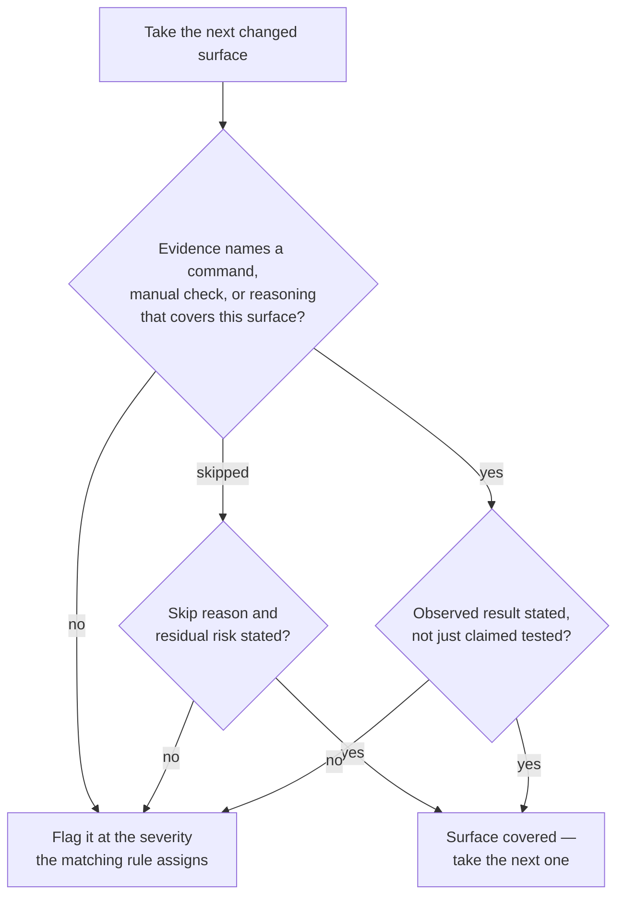

# Verification Evidence

Apply these rules when reviewing whether the author proved the change works. Verification evidence is the observable record of checks performed, not a general claim that the change was tested.

## Evidence-Adequacy Decision Flow

Walk every changed surface through this flow; the change's evidence is adequate only when each surface exits at "covered". The severity of each flag is assigned by the specific rule that covers it — the sections below and the project's review severity tiers.

## Evidence Required Before Completion

A review should connect each changed surface to the command, manual check, or reasoning that covers it.

**Guidelines:**

- MUST require evidence that the project's format and lint commands ran after code or documentation edits.
- MUST require manual evidence for changed output surfaces listed in [manual-verification.md](./manual-verification.md).
- MUST map skipped required checks to a concrete reason and residual risk.
- MUST require a second-pass verification statement after fixing any finding the project's review severity tiers rank as Critical or Major.

## A Result That Could Not Have Come Out Otherwise

The rules above ask whether a surface is covered. This one asks something the coverage question cannot reach: whether the result offered as evidence was ever **capable of coming out differently**. A fixture that fails identically whether the code counts bytes or characters, a case that still passes after the fix it covers is reverted, and a harness that reports failure because it could not execute at all are all results that carry no information about the thing they name. Each reads exactly like evidence, which is why this has to be asked rather than assumed.

The insensitivity is usually in the setup rather than the assertion. Where the assertion itself is what fails to discriminate, the project's unit-testing practices own that rule — assert the distinguishing observable output, not that something merely happened — and this section does not restate it.

**Guidelines:**

- MUST ask of any result offered as evidence whether it would have differed had the behavior it covers been absent or broken, and treat a result that would not have differed as no evidence, however green.
- MUST require that a fixture chosen to discriminate between two candidate behaviors actually differ under them; a fixture that is equal under both — an all-ASCII input for a check that claims to measure bytes rather than characters — proves neither.
- MUST treat a failing result as evidence only for the cause claimed, confirming the check ran and failed for that reason, since a harness that cannot execute fails indistinguishably from the defect it would have caught.
- SHOULD ask how a green check was shown to be capable of failing — the fix reverted, the branch removed, the input broken — whenever that check is the only evidence for a behavior nothing else covers.

## Evidence Format

Evidence should be short but specific enough that another reviewer can see what was covered.

**Guidelines:**

- SHOULD state each command with its observed result, such as "the lint command passed" or "the format command reported no changes" — naming the actual invocation that was run.
- SHOULD name manual routes or surfaces checked, such as "the record-detail page in its non-default content state rendered the expected banner".
- SHOULD include relevant log, screenshot, or diff context when the result is not obvious from command success alone.
- MUST NOT accept "tested manually" or "looks fine" without the route, state, or behavior that was checked.
- MUST NOT accept a passing command as coverage for a surface the command does not exercise.
