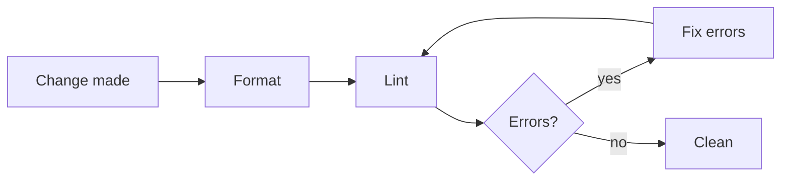

# Code Quality

Apply these rules whenever you write or modify code.

The project's own format and lint commands are what these rules run; find them where the project documents them, per [project-docs.md](./project-docs.md), rather than assuming an invocation.

## Check Sequence

The order matters because the linter reports problems the formatter alone does not resolve, so a passing format step is not proof the code is clean.

- The format command applies auto-fixable formatting. The lint command enforces the lint rules — and, in toolchains where the linter also checks formatting (e.g. Biome), re-flags format issues the formatter missed. In toolchains where it does not (e.g. ESLint with `eslint-config-prettier`), both steps are still always required.

**Guidelines:**

- MUST always run checks in this order after making any code change:
  1. **Format** (the project's format command) — auto-formats all modified files.
  2. **Lint** (the project's lint command) — detects code quality and remaining format issues.
  3. **Fix all reported errors.**
  4. **Re-run lint** — confirm all errors are resolved.

- MUST NOT skip or reorder these steps.

## Formatting

Delegating whitespace and layout to the formatter keeps diffs free of style noise and ends manual formatting debates in review.

**Guidelines:**

- MUST run the project's format command after every set of code changes, before committing or considering the task done.
- MUST NOT manually adjust spacing, indentation, or line endings — let the formatter handle them.
- MUST NOT submit code that has not been passed through the formatter.

## Linting

The linter catches correctness and quality problems the formatter cannot see (and, when it also enforces format rules, re-flags any that slipped past the formatter).

**Guidelines:**

- MUST run the project's lint command after formatting to surface code quality issues.
- MUST fix every lint **error** before considering the task complete.
- SHOULD fix lint **warnings** in any file that was modified as part of the task. MAY also fix pre-existing warnings in those files.
- MUST NOT suppress lint rules with the linter's inline suppression directive unless there is a clear, documented reason why the rule cannot be satisfied.
  - When suppression is genuinely necessary, add an inline comment on the same line explaining the reason.

## Comments

There are two kinds of comment, each with its own style: **doc-comments** that document an API, and **explanatory comments** that explain a specific spot in the code. Both are written in the comment voice below, and both are held to the admissibility test that follows it before either kind's own form and length rules apply. These rules apply to source-code comments only, not to commit messages — which the project's Conventional Commits practices own — or to prose documentation.

### Comment Scope

What makes text a comment is what it does, not what syntax carries it: text whose only purpose is to explain the artifact it sits beside, and that no program reads as data. Most languages carry that text in dedicated comment syntax — `//`, `#`, `/* */` — and every rule in this section reaches it directly. A format that offers no comment syntax at all does not fall outside these rules by construction: where the format provides a field or keyword for commentary and nothing reads that field to render, validate, or act on it — JSON Schema's `$comment` keyword is the worked example — that field carries a comment, and every rule in this section reaches it too. The reverse also holds: a field the format defines for something a program does read — renders to a user, validates input against, or hands to a downstream consumer — is data, not commentary, however prose-like its content looks; JSON Schema's own `description` keyword is exactly that, since a tool renders or consumes it, so the rules in this section do not reach it.

**Guidelines:**

- MUST treat text as a comment when its only purpose is to explain the artifact it sits beside and no program reads it as data, whatever syntax carries it.
- MUST treat a field or keyword a format provides for commentary — one no validator, renderer, or consumer reads — as a comment held to every rule in this section, where the carrying format offers no dedicated comment syntax.
- MUST NOT treat a field a program renders, validates against, or hands to a consumer as a comment, however prose-like its content reads; the rules in this section do not reach it.

### Comment Voice

The voice is stated here rather than inferred from the surrounding files, because inferring it fails exactly when it matters. A codebase drifts the moment one large change is written in a different style, and from then on the surrounding files answer two ways — so a rule that points at them hands the next author whichever answer they happened to open, and no linter can see the disagreement. A stated voice answers once.

Comment prose is lowercase, and emphasis comes from what a sentence says rather than from capitalising a word. All-caps shouts at a reader who has no way to tell an emphasised word from an identifier, and it decays fastest in the comments that carry the most weight, where several emphasised phrases in one paragraph leave none of them emphatic.

**Guidelines:**

- MUST write comment prose in lowercase, first word of a sentence included, unless the word keeps its own casing under the rule below.
- MUST NOT use all-caps for emphasis. Rewrite the sentence so its structure carries the emphasis, or drop the emphasis.
- MUST keep the real casing of anything whose casing is part of its identity — proper nouns, code identifiers, file and directory paths, environment variable names, format and protocol names, and acronyms. Lowercasing `GITHUB_TOKEN` or `sha256` names something else.
- MUST keep a linter suppression directive in the tool's required casing; only the trailing human-readable reason follows the comment voice.
- MUST follow the project's own comment convention instead of this default where the project documents one. A project documents a convention by stating it — in its contributor documentation or its agent instructions — not by having source files that exhibit it.

### Admissibility

A comment earns its place only by carrying something the code beside it does not already say. Read the code — including following it to the definition, type, call site, or test it itself names — and a comment that only reports what that reading already produced has added a second copy of the same fact, not a second fact. That failure is not fixed by phrasing it more carefully: a restated fact stays a restated fact no matter how it is worded, so the fix is deleting the comment, never rewriting it.

Two comment forms fail this test regardless of what they say, because neither carries a fact in the first place: an author line or a change-history block in a file header, which version control already owns and keeps more accurately than a comment anyone could forget to update; and a banner or section-divider comment, which marks a boundary the code's own structure — a file, a function, a blank line — already marks.

**Guidelines:**

- MUST NOT write a comment that states anything a reader recovers by reading the code it sits beside, or by following that code to a definition, type, call site, or test the code itself names.
- MUST delete a comment that fails the test above rather than reword it; a restated fact is inadmissible at any length or phrasing.
- MUST NOT add an author line or a change-history block to a file header.
- MUST NOT add a banner or section-divider comment.

### Doc-Comments

Doc-comments carry the API-level documentation, written in the project's doc-comment standard. A public surface without one forces every consumer to read the implementation to learn what it does. A comment at the top of a module or file that states what it holds and why is a doc-comment like any other, whatever syntax the language uses to carry it — a leading `//` block in a language with no dedicated module-doc form documents the unit the same way `/** */`, `///`, or a docstring does elsewhere, so it follows the doc-comment standard's own form and length rather than the Explanatory Comments rules below.

**Guidelines:**

- MUST give every exported/public type definition, and every function whose body exceeds ~5 lines, a doc-comment in the project's doc-comment standard stating what it is or does.
- MUST treat a module- or file-level comment as a doc-comment regardless of the syntax carrying it, so neither the line-comment-form rule nor the length budget in Explanatory Comments below reaches it.
- MUST document the conditions under which a function throws, using the standard's throws tag (e.g., `@throws`), where the language uses unchecked exceptions; where an error reaches the caller as a value in the signature instead — a `Result` type, a `(value, error)` return pair, a typed union in the return type — the signature already states the condition, and no comment is owed on top of it.
- MUST NOT restate, in a documentation tag, a type the language's own type system already carries, in a statically typed language — a `@param {string} name` beside a parameter the signature already types as `string` repeats a fact the compiler already checks. This does not reach a language with no static type system to restate, such as plain JavaScript's existing `@param` usage.
- SHOULD add parameter/return documentation only when the name and type do not already make the meaning obvious; do NOT add restating noise.

### Explanatory Comments

An explanatory comment that clears the admissibility test above still has to be written in the right shape: the language's own line-comment form, and short enough that a reader can hold it at a glance while still seeing the code it sits beside. That limit is a budget on the comment's prose, not on the lines carrying it — the same paragraph pushed onto fewer, longer lines is exactly as long to read, so a limit stated in lines can be satisfied without shortening anything.

**Guidelines:**

- MUST write an explanatory comment in the language's line-comment form (e.g. `//`, `#`) rather than a block-comment form, where the carrying language offers a choice of comment forms; a commentary field or keyword in a format with no comment syntax of its own — see Comment Scope above — has no such choice to make and this rule does not apply to it.
- MUST keep an explanatory comment within a budget of about 300 characters of comment text — roughly four lines at an 80-column wrap, with a single line well within it. The budget protects a comment a reader can hold at a glance while still seeing the code it sits beside: rewrapping the same paragraph onto fewer, longer lines never brings it inside the budget, only shortening the prose does. A comment that needs more room is carrying material that belongs in Outside the Code below, not in a longer comment, unless that section's carve-out for file-local implementation rationale admits it.
- MUST NOT delete a comment that explains a "why", an edge case, or non-obvious behavior.
- MUST let the linter/formatter enforce comment conventions where it can, and fix any comment-style violations it reports.

### TODO Comments

A `TODO` is a promise that something not-yet-good-enough gets finished later, and a promise nobody can find again is not a plan. Marking it with the issue it is tracked under is what keeps it findable — and pointing at the project's own issue tracker anywhere else in a comment does not earn that same concession, because nothing there anchors it to being acted on. A `TODO` is an explanatory comment, so the form and length rules above govern it too; what the issue it names cannot hold belongs in that issue rather than in a longer comment.

What makes a site a `TODO` is the code sitting beside it, not the state of the issue the comment references: a `TODO` marks code that is itself unfinished, and that is the test, never whether the referenced issue happens to be open or closed. An issue can stay open long after every decision it records has already landed — a multi-step umbrella whose early steps shipped and whose last is still moving — and citing that issue does not make an already-finished site unfinished. Converting such a site to a `TODO` for the sake of keeping a reference tracked tells the next reader that finished code still needs work, which is a worse defect than the bare reference it replaces.

Four other comment forms carry an identifier or a URL for a different reason: each names something the code cannot state at all, and a documented standard already prescribes exactly this shape for it.

**Guidelines:**

- MUST write a `TODO` comment as `TODO(#123):` — the issue number in parentheses immediately after `TODO`, no space, followed by a colon — unless the project documents its own convention, in which case follow that instead.
- MUST reference, in a `TODO(#123):` comment, an issue already tracked in the project's own issue or ticket tracker that resolves to a follow-up someone can act on.
- MUST write a `TODO` only where the code beside it is itself unfinished; an issue's own open state is not by itself grounds for one, and an issue that is open but whose decisions the code already implements gives no license to mark that site a `TODO`.
- MUST use `TODO` for anything temporary or good-enough-but-not-perfect that a future action can settle, and MUST NOT mark the same case with `FIXME`, `XXX`, `HACK`, or any other marker; `TODO` is the one vocabulary this convention collects.
- MUST NOT reference the project's own issue or ticket tracker anywhere in a comment except inside a `TODO(#123):` comment; a bare issue number or a link to one, left in an explanatory comment or a doc-comment, is not admissible.
- MUST treat each of the following as admissible despite carrying an identifier or a URL:
  - an SPDX license identifier at the top of a source file — `// SPDX-License-Identifier: MIT`
  - a linter suppression directive's required reason — `// eslint-disable-next-line no-explicit-any -- vendor types are wrong here`
  - a documentation standard's own reference-link syntax inside a doc-comment, resolved by that standard rather than left as a bare address — Go's `[Wrap]`-style doc link, or TSDoc's `{@link}` tag
  - a reference to the upstream bug or specification a workaround is written against, naming the tracker and the issue rather than only describing it — `// works around a parser bug in the vendor's library, tracked upstream as issue 4821, until the next release`

### Outside the Code

A comment kept out by the rules above still has to go somewhere, or the discipline just deletes information instead of relocating it. Three destinations cover most of what gets evicted: a specification or glossary entry for a specification fact or a domain term, a decision record for rationale that constrains future work, and the commit message for the reasoning behind one diff. They do not cover file-local implementation rationale — a "why" that explains why the code beside it is shaped as it is. That rationale is not a specification fact or a domain-vocabulary definition; it is not a decision constraining future work whose rationale the code cannot recover; and it is not the reason for one diff, because the reader needs it while reading the code, not while reading history. A "why" of that kind that also will not come within the budget above without dropping a step the reader needs stays where it is and over the budget, whether or not the project ships a living-documentation capability. The rule against deleting such a comment outranks the length budget, because that budget exists to relocate material rather than to destroy it.

**Guidelines:**

- MUST move a specification fact or a domain-vocabulary definition evicted from a comment into a specification or glossary entry, and a piece of rationale evicted from a comment into a decision record, where the project ships a living-documentation capability — consult that capability for when a record is owed and how it is written, rather than any summary of that gating here.
- MUST route the reasoning behind a specific change to the commit message that made it, per the project's Conventional Commits practices, rather than leaving it in a comment beside the diff.
- MUST check a comment over the budget against the three destinations above before leaving it beside the code: a comment any one of them accepts belongs there, not in place.
- MUST leave a comment in place and over the budget when none of the three destinations accepts it because it is file-local implementation rationale, and shortening it into the budget would drop a step the reader needs.

## Import Hygiene

Stale imports misrepresent a module's real dependencies and can drag dead code — or another runtime's code — into the bundle.

**Guidelines:**

- MUST NOT leave unused imports in modified files. The linter will flag these, but resolve them proactively.
- MUST NOT use barrel re-export files (an `index` module that re-exports everything) as import sources when a direct import path is available. Import directly from the module file.
  - This keeps bundle size small and avoids accidentally pulling in code intended for one runtime/boundary into another.
- SHOULD use type-only imports when the language supports them and the imported symbol is a type that is not used as a value.
