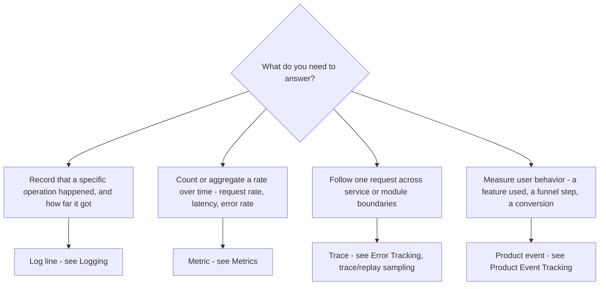

# Software Instrumentation

Use this capability whenever you instrument software to make its behavior observable — adding or reviewing the code that emits telemetry (logs, errors, traces, or product events) or that configures the tools those signals flow into. Instrumenting well is what turns a production incident from a guess into a lookup.

The guidance is deliberately tool-agnostic. It names roles — **your structured logger**, **your error tracker** (error-reporting service), **your analytics tool** — rather than specific SDKs, and the code snippets use placeholder function names such as `logger.info(...)`, `reportError(...)`, and `trackEvent(...)` that map onto whatever your project has adopted. Substitute the concrete names when applying a rule; keep the shape.

That substitution is where a vendor-specific capability takes over. Which package to depend on, which option controls what is collected, how source maps reach the service, and where its build-time token may appear are vendor questions this skill deliberately does not answer; the installed tracker's own instrumentation capability owns them. Use both together: this skill decides what to instrument, the vendor's decides how that is carried out.

Observability rests on three signal types — **logs**, **metrics**, and **traces** — made actionable by disciplined **error handling** and a dedicated **error tracker**. **Product events** sit alongside them: the same act of measurement pointed at user behavior instead of system health, with its own naming, identity, and consent rules. Each reference below owns one of those concerns; load the ones the change touches.

The key words "MUST", "MUST NOT", "REQUIRED", "SHALL", "SHALL NOT", "SHOULD", "SHOULD NOT", "RECOMMENDED", "MAY", and "OPTIONAL" in this document are to be interpreted as described in [RFC 2119](https://www.rfc-editor.org/rfc/rfc2119.html).

## Choosing a Signal

Reach for the signal that answers the question you expect to ask in production, not the one that is easiest to add. The flow below routes a need to its signal and to the reference that owns it; **traces** are instrumented through the error tracker's tracing integration, so they live with error tracking.

An unexpected failure is not on this flow because it is not one of these choices: report it to the error tracker (see Error Handling and Error Tracking), and let disciplined logging supply the breadcrumb trail that leads up to it.

## Error Handling

See [error-handling.md](./references/error-handling.md) for:

- Where to place try-catch blocks and how errors propagate to the root call site
- The caught-error decision flow — rethrow a control-flow signal, report an unexpected failure, then recover or rethrow
- Reporting caught errors before an early return, redirect, or fallback path
- Top-level error boundaries and writing actionable error messages

**Guidelines:**

- MUST read [error-handling.md](./references/error-handling.md) before adding or moving a try-catch, before letting a catch block swallow, recover from, or rethrow what it caught, and before adding a top-level error boundary or writing the message an error carries.

## Error Tracking

See [error-tracking.md](./references/error-tracking.md) for:

- Integrating an error-reporting service behind one project wrapper or init/config file
- Which failures are worth capturing and which are ordinary control flow
- Breadcrumbs, trace/replay sampling, and instrumentation boundaries
- Keeping secrets and PII out of telemetry event context

**Guidelines:**

- MUST read [error-tracking.md](./references/error-tracking.md) before wiring an error-reporting service or its init module, before adding a capture call, a breadcrumb, or a sampling rate, and before attaching context to a reported event.

## Logging

See [logging.md](./references/logging.md) for:

- When an operation is worth logging and when it is noise
- The log-level decision flow, and choosing a level (`info` / `warn` / `debug`; `error` reserved for projects without an error tracker)
- Deriving module-scoped child loggers from one shared root logger
- Structured context objects and "Started / Completed" message conventions

**Guidelines:**

- MUST read [logging.md](./references/logging.md) before adding a log call or choosing its level, and before configuring the root logger or deriving a module-scoped child from it.

## Metrics

See [metrics.md](./references/metrics.md) for:

- Deciding when a health signal earns a metric rather than a log line
- Choosing between a counter, a gauge, and a distribution, and declaring the unit
- Keeping labels low-cardinality, and the identifiers that must never become one
- Emitting through one wrapper that is gated, non-blocking, and cannot throw

**Guidelines:**

- MUST read [metrics.md](./references/metrics.md) before emitting a counter, gauge, or distribution, before attaching a label to one, and before adding the wrapper a metric is emitted through.

## Product Event Tracking

See [product-event-tracking.md](./references/product-event-tracking.md) for:

- The one module that owns the analytics SDK, and the typed event schema in front of it
- Naming an event so it survives a redesign, and normalizing names and keys at one boundary
- Event properties versus user properties, cardinality, and what never belongs in a payload
- Emitting where the fact becomes true, including the failure path and the server-side case
- Identity calls, reset on logout, session definitions, and consent-gated initialization
- Asserting an event in tests, and migrating or retiring one without emptying a chart

**Guidelines:**

- MUST read [product-event-tracking.md](./references/product-event-tracking.md) before naming, adding, renaming, or retiring a product event, before choosing its properties or where the call sits, and before writing an identity, reset, or consent-gated initialization call.
