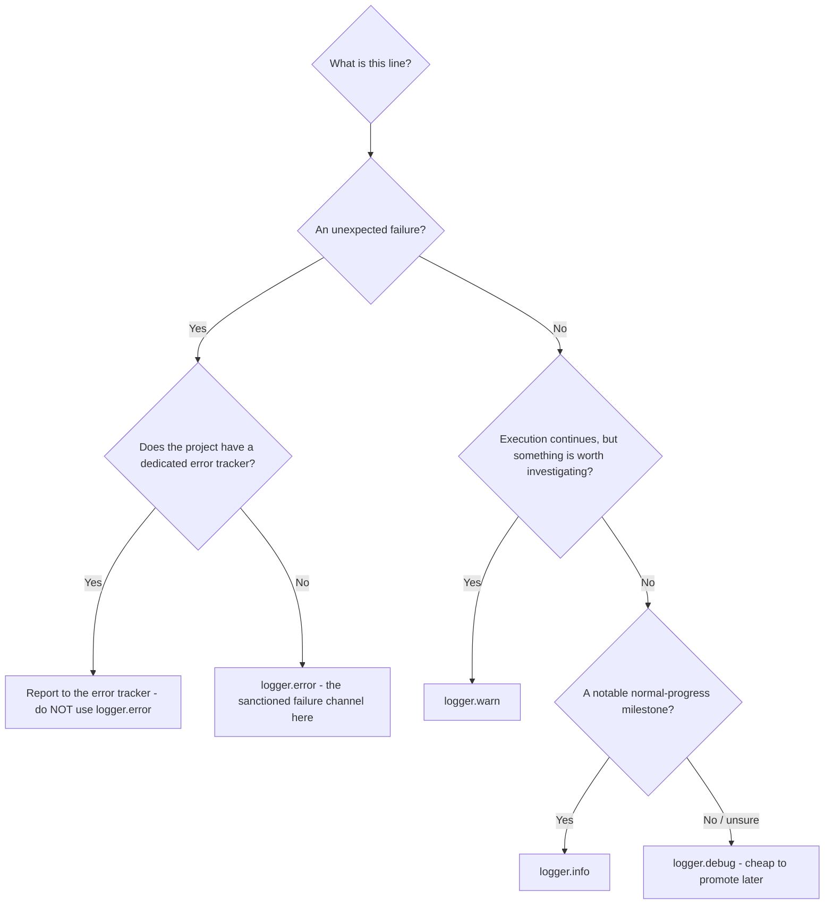

# Logging

Apply this reference when instrumenting or reviewing any code that emits log output. "Logs" is the first of the three observability signal types; this file assumes a **structured logger** (JSON or key-value output — e.g. Pino, Winston, Bunyan, zap, slog, structlog, or a React Native logger). If a project has no structured logger, drop transient `console` diagnostics before committing and report unexpected failures to the error tracker instead (see [error-tracking.md](./error-tracking.md)).

## When to Log

A log line pays off during an incident, when the question is which operation was in flight and how far it got — the operations that stall or fail are the ones worth bracketing, and the trivial ones are the ones that bury them.

**Guidelines:**

- SHOULD log the start and end of any operation that is slow, depends on an external system, or can fail (database queries, HTTP fetches, sign-in requests, file or media processing).
- SHOULD log unexpected-but-recoverable conditions (a record skipped due to a parse error, an invariant violated while execution continued).
- SHOULD NOT log trivial or extremely frequent operations (individual UI renders, synchronous computations, per-iteration work inside a hot loop).

## Log Levels

Levels are the filter operators reach for under pressure, so a message at the wrong level is either noise burying a signal or a signal buried in noise. Choose the level from what the line is for and how visible it should be in production.

| Level   | Use for                                                                                                                                                | Production visibility                                |
| ------- | ------------------------------------------------------------------------------------------------------------------------------------------------------ | ---------------------------------------------------- |
| `debug` | Verbose, high-frequency, step-by-step tracing of an operation's internals — valuable while developing or reproducing, too noisy for production output. | Suppressed from console; still useful as breadcrumbs |
| `info`  | Notable normal-progress milestones — the completion of a cross-boundary or user-significant operation, not each internal step of it.                   | Shown                                                |
| `warn`  | Recoverable unexpected conditions — execution continues but something is worth investigating.                                                          | Shown                                                |
| `error` | Reserved — see the rule below.                                                                                                                         | —                                                    |

The flow below picks the level from the existing rules in order — an error with a dedicated tracker never routes to `logger.error()`, and an uncertain trace defaults to `debug`:



**Guidelines:**

- SHOULD use `logger.info()` for normal-progress milestones that stay valuable in production.
- SHOULD use `logger.warn()` for recoverable unexpected conditions where execution continues.
- SHOULD use `logger.debug()` for routine per-step lifecycle tracing, and prefer `debug` over `info` when unsure — a trace that turns out to matter is cheap to promote, whereas surplus production `info` is exactly the noise levels exist to filter.
- MUST NOT use `logger.error()` for errors **when the project has a dedicated error tracker** — report the error there and let it propagate (see [error-handling.md](./error-handling.md)). Only when there is **no** error tracker is `logger.error()` the sanctioned channel for an unexpected failure.

## Logger Setup

One shared root logger owns severity and transport configuration; per-module child loggers make every line attributable to the code that emitted it without each module re-deciding how logging works. When a transport also forwards a line onward — mirroring it into a breadcrumb, or turning a designated level into a product event — [product-event-tracking.md](./product-event-tracking.md) owns that fan-out and where it belongs.

**Guidelines:**

- MUST derive loggers from the project's shared **root logger** instead of constructing a new logger instance in each module.
- MUST create one **child logger per module**, tagged with a `module` (or namespace) field that identifies the emitting module, so lines are filterable by module:

  ```typescript
  import { rootLogger } from "the project's shared logger module";

  const logger = rootLogger.child({ module: "data-fetch" });
  ```

- SHOULD choose a `module` identifier that conveys the module's concern at a glance and is unique per module.
- MAY adopt a short, scannable convention for the identifier (for example an emoji per module) when the team finds it useful.

## Structured Log Format

A structured logger takes a **context object** of searchable fields alongside the **message string**. Passing identifiers as structured fields — rather than interpolating them into the message — is what makes logs queryable later.

```typescript
// No context needed
logger.info("Started fetching records.");

// With context — identifiers and timing as structured fields
logger.info({ id }, "Started fetching record.");
logger.info(
  { id, duration: performance.now() - startedAt },
  "Completed fetching record.",
);
```

**Guidelines:**

- SHOULD attach identifiers (an entity `id`, `url`, `filename`) as structured fields rather than interpolating them into the message string.
- SHOULD include timing (`duration`) on "completed" lines for operations where latency matters.
- MUST NOT log values that can contain sensitive user data (passwords, tokens, PII) — log identifiers and metadata only. When the logger mirrors lines into error-tracker breadcrumbs, this context ships off-system too (see [error-tracking.md](./error-tracking.md)).
- SHOULD match the argument order your logger expects (some take `(context, message)`, others `(message, context)`); keep it consistent project-wide.

## Message Conventions

A consistent past-tense / gerund phrasing makes a log stream scannable — you can see an operation's lifecycle at a glance instead of parsing ad-hoc wording.

| Moment                             | Prefix                               | Example                                   |
| ---------------------------------- | ------------------------------------ | ----------------------------------------- |
| Beginning of an operation          | `"Started ..."`                      | `"Started fetching records."`             |
| Successful completion              | `"Completed ..."` / `"Finished ..."` | `"Completed fetching external metadata."` |
| Recoverable skip / partial failure | descriptive past tense               | `"Skipped a record due to parse error."`  |

```typescript
// CORRECT — bracket the operation
logger.info({ url }, "Started fetching external metadata.");
// ... operation ...
logger.info({ url, duration }, "Completed fetching external metadata.");

// CORRECT — warn on a recoverable skip
logger.warn(
  { id: record.id, error: parseError },
  "Skipped a record due to parse error.",
);

// WRONG — vague, not scannable
logger.info("done");
logger.info("error fetching record");
```

**Guidelines:**

- SHOULD bracket a logged operation with a matching "Started ..." / "Completed ..." pair so a stalled operation is visible as a start with no completion.
- MUST end every log message with a period (`.`) for grammatical consistency.
